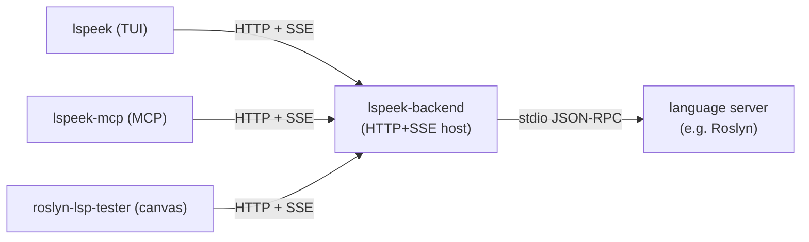

# lspeek

A toolkit for interactively driving [Language Server Protocol](https://microsoft.github.io/language-server-protocol/)
servers — send requests, inspect responses, watch logs and work-done progress, and reproduce LSP
bugs against a local build.

A single **backend** owns the LSP server (spawns it, forwards requests/notifications, auto-answers
infrastructure requests, and records **every** frame in both directions). Three thin **frontends**
drive that backend over a local HTTP + Server-Sent-Events API on `127.0.0.1`:

- **TUI** (`lspeek`) — a [Spectre.Console](https://spectreconsole.net/) terminal UI.
- **MCP server** (`lspeek-mcp`) — exposes the backend as agent-callable [MCP](https://modelcontextprotocol.io/) tools.
- **Canvas extension** (`roslyn-lsp-tester`) — a GitHub Copilot CLI canvas with a clickable timeline.

Every frontend spawns its **own private backend** (one live server per TUI/MCP process and per canvas
`instanceId`); they don't share a session. The three frontends expose the **same action surface**, so
the server is driven the same way regardless of which you use.

## Architecture



| Component | Project | What it is |
| --- | --- | --- |
| Core library | `src/Client.Core` | Reusable LSP session library: raw Content-Length JSON-RPC client, seq-numbered message buffer, server-config + Roslyn build resolution, LSP metamodel. |
| Shared contracts | `src/Client.Protocol` | Wire DTOs + the C# `BackendClient` (spawns the backend, typed HTTP methods, SSE consumer). |
| Backend host | `src/Client.Backend` | The `lspeek-backend` exe: a minimal-API HTTP+SSE host that owns the server lifecycle and serves the web UI. |
| TUI | `src/Client.Tui` | The `lspeek` dotnet tool. |
| MCP server | `src/Client.Mcp` | The `lspeek-mcp` stdio server; one tool per backend action. |
| Canvas | `.github/extensions/roslyn-lsp-tester` | Thin JS client that spawns the backend and proxies actions; the backend serves its UI. |
| Skill | `skills/roslyn-lsp-control` | How-to for driving a Roslyn server through any of the three frontends. |

## The action surface

All three frontends expose the same actions (the MCP tool names **are** these action names; the
canvas calls them via `invoke_canvas_action`; the TUI maps its UI / JSON scripts onto them):

| Action | Purpose |
| --- | --- |
| `start_server` | Resolve + spawn the server (named/config server, or Roslyn build resolution). Replaces any running one. |
| `stop_server` | Graceful `shutdown` + `exit`, then kill. |
| `server_status` | Running state, pid, resolved dll, command line, message/pending counts. |
| `lsp_request` | Send a request and **wait** for its response. |
| `lsp_notify` | Send a notification (no response). |
| `send_raw` | Send an arbitrary JSON-RPC object/array verbatim; optional `waitForResponse`. |
| `respond_to_request` | Manually answer a server→client request (when `autoRespond:false`). |
| `get_messages` | Read buffered traffic; poll with `sinceSeq` for new async output. |
| `wait_for_message` | Block until a matching server message arrives (by `method` or `containsText`). |
| `clear_messages` | Clear the buffer (server keeps running). |
| `help` | Built-in cheat-sheet. |

See [`skills/roslyn-lsp-control/SKILL.md`](skills/roslyn-lsp-control/SKILL.md) for the full
message-composition guide (initialize handshake, loading projects, reading diagnostics/progress,
gotchas).

## Installing

Both .NET frontends ship as [.NET tools](https://learn.microsoft.com/dotnet/core/tools/global-tools)
that are **self-contained and platform-specific**, with a self-contained copy of the backend
**bundled inside the package** (under `tools/any/<rid>/backend/`). An installed tool carries its own
runtime and spawns its bundled backend — no .NET runtime and no extra setup required:

```bash
dotnet tool install --global lspeek        # the TUI
dotnet tool install --global lspeek-mcp    # the MCP server
```

`dotnet tool install` reads each tool's RID manifest and fetches the payload matching your machine.
The frontends are published for the full RID set — **win-x64, win-arm64, linux-x64, linux-arm64,
linux-musl-x64, linux-musl-arm64, osx-x64, osx-arm64**. To run without installing, use
`dnx lspeek …` (the TUI) or point your agent at the packed `lspeek-mcp`.

## Building

```bash
dotnet build lspeek.slnx
```

This builds the backend (`lspeek-backend`) alongside the frontends. The TUI, MCP, and canvas
**discover and spawn** the backend automatically. The .NET frontends (TUI, MCP) look, in order, for:

1. the `LSPEEK_BACKEND` environment variable, if set (a host file, or a directory containing it), then
2. a bundled `backend/` subdirectory beside the frontend (`AppContext.BaseDirectory/backend/`).

Packaged tools ship a **self-contained** copy of the backend in that `backend/` folder — a
platform-specific apphost run directly; a local `dotnet build` copies the backend's **managed** build
output there instead (run via `dotnet exec`). Either way the same `backend/` probe finds it.

The canvas extension can't bundle a .NET app, so it uses the same `LSPEEK_BACKEND` override and in-repo
dev build, then falls back to **`dotnet dnx lspeek-backend`** — fetching the published backend tool from
NuGet (a self-contained, ReadyToRun, platform-specific build for every supported RID; cached after first
run) so it works off-repo with only the .NET SDK installed. See
[the canvas section](#canvas-extension-roslyn-lsp-tester) for details.

Set `LSPEEK_BACKEND` to override discovery — e.g. point every frontend at one freshly built backend
while iterating on it.

## TUI (`lspeek`)

```
lspeek <server> [--no-init] [--json <PATH>] [--exit]      # installed global tool
dnx lspeek <server> [...]                                 # or run without installing
```

| Argument / Option | Description |
|---|---|
| `<server>` | Built-in server name (e.g. `roslyn`) or path to a server config JSON file |
| `--no-init` | Skip the automatic `initialize` / `initialized` handshake |
| `--json <PATH>` | Run a JSON script file in non-interactive mode before entering the TUI |
| `--exit` | Exit after the script completes (use with `--json`) |

### Examples

```bash
lspeek roslyn                          # launch and connect to Roslyn
lspeek roslyn --no-init                # skip handshake
lspeek roslyn --json replay.json       # run a script then enter TUI
lspeek roslyn --json replay.json --exit # run a script and exit
lspeek ./my-server.json                # use a custom server config
```

Use `X` in the TUI to export a session as a replayable script.

## MCP server (`lspeek-mcp`)

A stdio MCP server that exposes the action surface as tools, each driving this process's own private
backend. Register it with your agent's MCP configuration, pointing at the installed `lspeek-mcp`
command (after `dotnet tool install --global lspeek-mcp`) or at `dotnet run --project src/Client.Mcp`.
stdout is reserved for the MCP protocol; logs go to stderr.

Each tool returns a JSON envelope: `{ ok:true, ... }` on success or `{ ok:false, error }` on failure.

## Canvas extension (`roslyn-lsp-tester`)

A GitHub Copilot CLI canvas that spawns the backend, proxies every action over HTTP, and shows the
backend's web UI (a clickable timeline of all traffic with a manual JSON send box). It lives in this
repo under [`.github/extensions/roslyn-lsp-tester`](.github/extensions/roslyn-lsp-tester), so the
Copilot CLI auto-discovers it when working in the repo. Confirm it loaded with
`list_canvas_capabilities(canvasId:"roslyn-lsp-tester")`, then `open_canvas` and drive it with
`invoke_canvas_action({ instanceId, actionName, input })`.

### Running off-repo (no local build)

The canvas is two small JS files — it can't bundle the .NET backend the way the packaged tools do.
Instead, when it can't find a local backend (no `LSPEEK_BACKEND`, no in-repo build) it runs
**`dotnet dnx lspeek-backend`**, which downloads the published backend tool from NuGet on first use,
caches it, and launches it. So the only prerequisite off-repo is the **.NET SDK** (which provides `dnx`).

The backend ships as its own [`lspeek-backend`](https://www.nuget.org/packages/lspeek-backend) tool,
published as a **self-contained, ReadyToRun (R2R), platform-specific** build for every supported RID
(win/linux/osx, x64/arm64, glibc/musl) — a self-contained executable that bundles the .NET runtime, so
the backend needs **no .NET runtime of its own**. R2R cross-compiles, so all RID payloads are built on a
single runner. `dnx` reads the package's RID manifest and fetches whichever payload matches the current
machine.

Optional environment overrides (read by the canvas):

| Variable | Effect |
|---|---|
| `LSPEEK_BACKEND` | Use a specific backend host file or directory instead of dnx (e.g. a local build). |
| `LSPEEK_BACKEND_VERSION` | Pin the dnx tool to an exact version (e.g. `1.0.42`) instead of the latest stable. |
| `LSPEEK_BACKEND_PRERELEASE` | Set to `1`/`true` to let dnx float to the latest **prerelease** version. |

## Built-in Servers

| Name | Description |
|---|---|
| `roslyn` | C# / VB language server via `Microsoft.CodeAnalysis.LanguageServer` |

## Custom Server Configuration

Point `<server>` (TUI) or the `server` option (MCP/canvas) at a JSON file to connect to any LSP
server:

```json
{
  "name": "my-server",
  "command": "path/to/server",
  "arguments": ["--stdio"]
}
```

## Scripting (TUI)

Sessions can be automated with JSON script files. A script is a JSON array of messages to send:

```json
[
  {
    "type": "request",
    "method": "textDocument/hover",
    "params": {
      "textDocument": { "uri": "file:///path/to/file.cs" },
      "position": { "line": 10, "character": 5 }
    }
  },
  {
    "type": "notification",
    "method": "textDocument/didOpen",
    "params": { "textDocument": { "uri": "file:///path/to/file.cs" } }
  }
]
```

In script mode, status/progress is written to stderr and per-message results are written to stdout.
When you use `--json`, lspeek does not send `initialize` or `initialized` automatically; if the
session needs that handshake, the script must include it explicitly.

Each entry supports:

| Field | Default | Description |
|---|---|---|
| `method` | *(required)* | LSP method name |
| `params` | `{}` | JSON payload |
| `type` | `"request"` | `"request"` or `"notification"` |

## Repository layout

```
src/
  Client.Core/        LSP session library (raw transport, message buffer, server resolution)
  Client.Protocol/    shared DTOs + C# BackendClient
  Client.Backend/     lspeek-backend: HTTP+SSE host (owns the server, serves the UI)
  Client.Tui/         lspeek: terminal UI
  Client.Mcp/         lspeek-mcp: MCP stdio server
.github/extensions/
  roslyn-lsp-tester/  canvas extension (thin client over the backend)
skills/
  roslyn-lsp-control/ how-to skill for driving a Roslyn server
tests/
  Tests.Integration/  raw-client, message-buffer, and surface-parity tests
```
